# PSOC&trade; 4 Inductive sensing (ISX) training manual

## About this document

This training manual covers the labs for the introduction to inductive sensing (ISX) on the PSOC&trade; 4000T and the PSOC&trade; 4100T Plus.

## Scope and purpose

The manual covers the following objectives: project creation, manual tuning of inductive sensors, tuning of inductive sensors using the smart sensing algorithm, and key takeaways.

## Intended audience

This manual is intended for design engineers, technicians, and developers of electronic systems.

## Table of contents

* [About this document](#about-this-document)
* [Scope and purpose](#scope-and-purpose)
* [Intended audience](#intended-audience)
* [Introduction](#introduction)
* [Required development tools and prerequisites](#_Required_development_tools)
* [Inductive sensor manual tuning procedure](#inductive-sensor-manual-tuning-procedure)
* [Inductive sensor with smart sensing tuning procedure](#inductive-sensor-with-smart-sensing-tuning-procedure)
* [References](#references)
* [Revision history](#revision-history)

## Introduction

This manual provides instructions to create, configure, and build the **PSOC&trade; 4000T MSCLP inductive sensing touch-over-metal keypad-4** project to optimise the inductive sensor performance and enable a smart sensing algorithm.

## Required development tools and prerequisites

### Tools

- **ModusToolbox&trade; software** v3.9 or later (Recommended installation via [ModusToolbox&trade; Setup tool](https://softwaretools.infineon.com/tools/com.ifx.tb.tool.modustoolboxsetup))
- [**Microsoft Visual Studio Code**](https://code.visualstudio.com/) with the [**ModusToolbox&trade; for VS Code**](https://marketplace.visualstudio.com/items?itemName=InfineonAG.modustoolbox-for-vscode) extension installed
- **ModusToolbox&trade; Programming Tools** v1.9.0 or later (Installed by [ModusToolbox&trade; Setup tool](https://softwaretools.infineon.com/tools/com.ifx.tb.tool.modustoolboxsetup) as a dependency to ModusToolbox&trade; v3.9)
- **ModusToolbox&trade; CAPSENSE&trade; and Multi-Sense Pack** v1.6.0 or later (Recommended installation via [ModusToolbox&trade; Setup tool](https://softwaretools.infineon.com/tools/com.ifx.tb.tool.modustoolboxsetup))
- An oscilloscope and DMM for inductive sensor tuning and power measurements
- [**CY8CPROTO-040T-MS**](https://www.infineon.com/evaluation-board/CY8CPROTO-040T-MS), the PSOC&trade; 4000T Multi-Sense Prototyping Kit

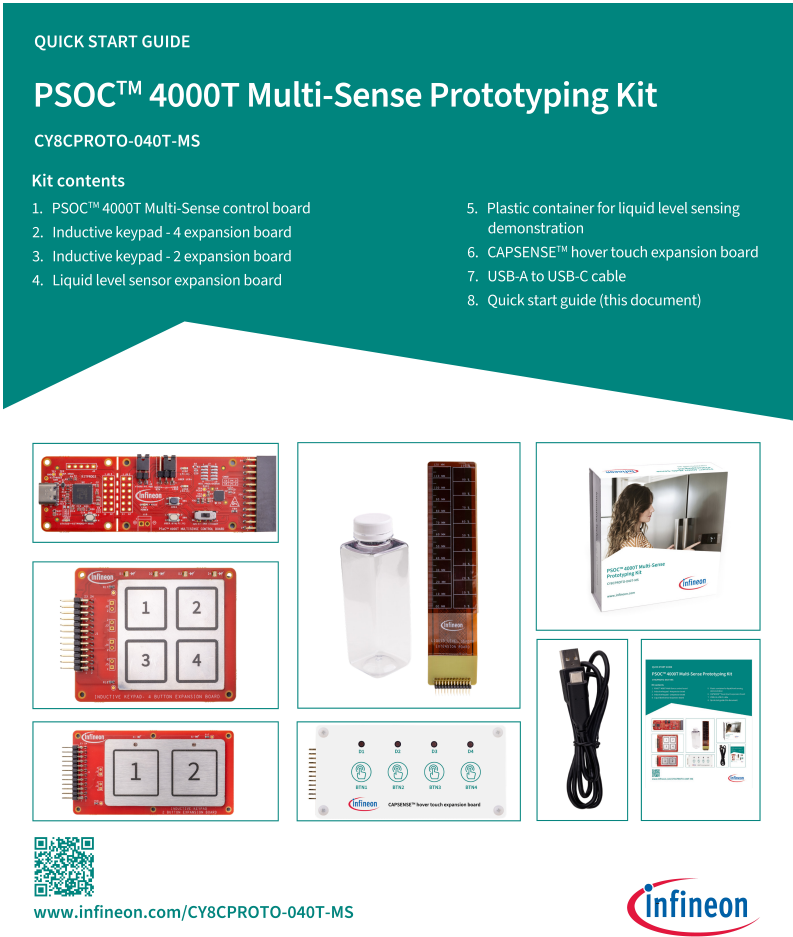

### Prerequisites

- [Introduction to PSOC&trade; 4000T Training](https://infineon-academy.csod.com/ui/lms-learning-details/app/course/073efb2e-7bbc-45ab-819d-12c504682ec0)
- Install the software and obtain the hardware listed in the Required development tools section.

## Inductive sensor manual tuning procedure

### Objective

The objective of this exercise is to learn how to use the Inductive sensing (ISX) performance tuning process. The MSCLP Inductive sensing touch over Metal Keypad-2 example project will have the device configured for optimal inductive sensor tuning, but tweaks can be made to show how each setting impacts the sensitivity of the sensors.

### Description

When tuning the inductive sensor, it is recommended to do the following performance tuning procedure. This process comprises four stages

1. [Set the initial hardware parameters](#_Stage_1_–)

2. [Set the Lx clock divider](#_Stage_2_–)

3. [Fine-tune for the required SNR](#_Stage_3_–_1)

4. [Tune threshold parameters](#_Stage_4_–_1)

### Project creation

1. Before creating the first project in this training series, create the workspace. Open **VS Code** from the **Windows Start** menu

> **Note:** If you have not installed ModusToolbox&trade; along with the ModusToolbox&trade; for VS Code extension, see the [Required development tools](#_Required_development_tools) section.

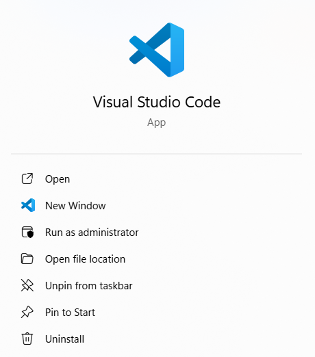

2. Open a **workspace directory** for your project in VS Code

3. Click **File > Open Folder** and choose your workspace directory or create a new folder
4. Click **Select Folder** to open the workspace directory in VS Code

> **Note:** Open the workspace in trusted mode. If the default workspace trust is restricted mode, click **Restricted Mode** in the bottom left and change to trust this folder.

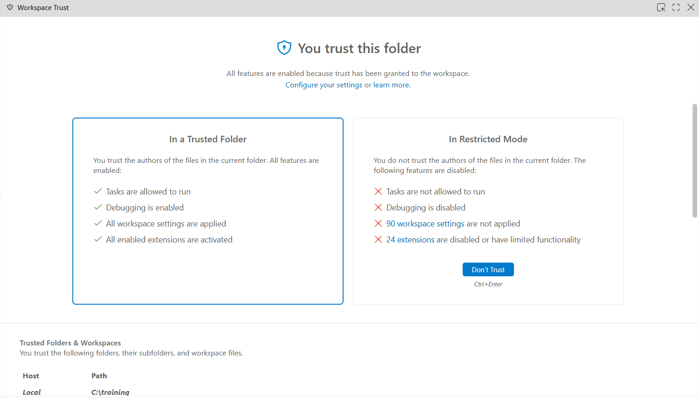

5. Open the **Command Palette** by pressing **Ctrl+Shift+P**
6. Search for **Infineon ModusToolbox&trade;: Show Main Page** and select it
7. Open the **Infineon ModusToolbox&trade; for VS Code** main page

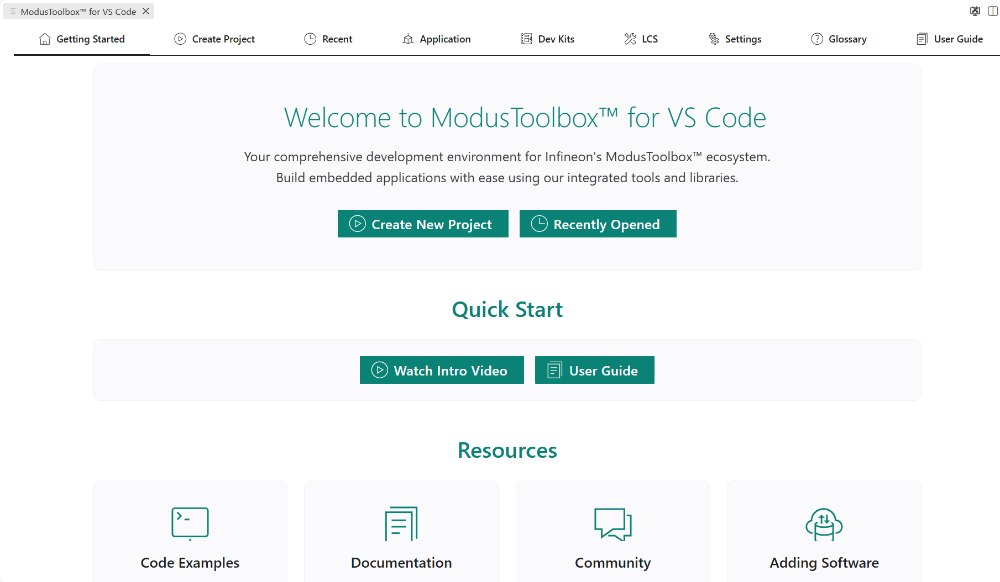

8. Navigate to the **Create Project** tab and click **Launch Project Creation**

9. The **Project Creator Tool** opens and prompts you to choose a **BSP** (Board Support Package). Select the **CY8CPROTO-040T-MS BSP** under the **PSOC&trade; 4 BSPs**, and continue to the application selection

> **Note:** BSPs are aligned with the development and evaluation kits; they provide files for basic device functionality. A BSP typically has a **design.modus** file that configures clocks and other board-specific capabilities. That file is used by the ModusToolbox&trade; configurators. A BSP also includes the required device support code for the device on the board. You can modify the configuration to suit your application.

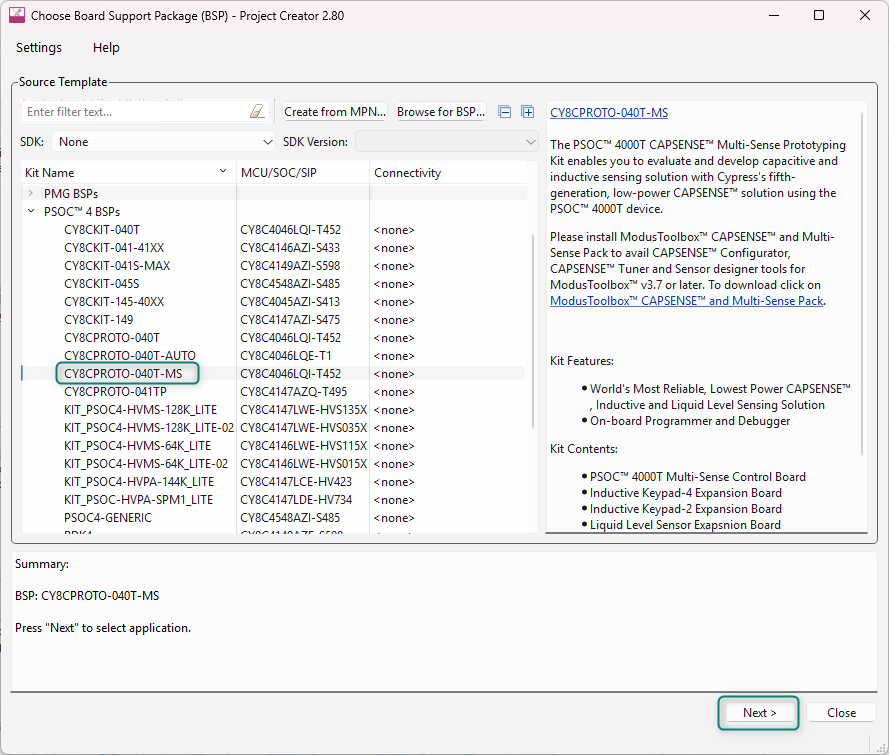

10. Select the **MSCLP Inductive Sensing Touch over Metal Keypad-2** under the **Sensing** section, choose a project directory, and create the project

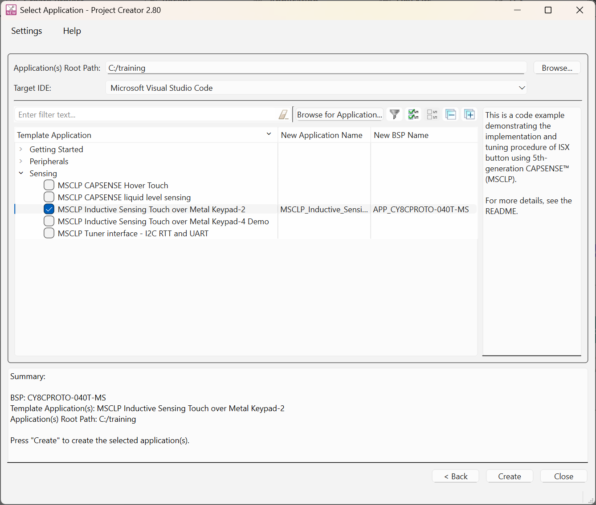

11. When project creation is complete, it will prompt you to **Load Project**. Do this so that the VS Code workspace for the new project is loaded

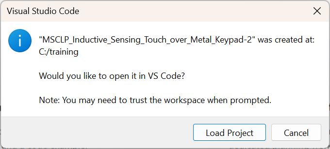

12. Once the workspace is loaded, the ModusToolbox&trade; application view provides actions to build, clean, erase, program, and configure the device

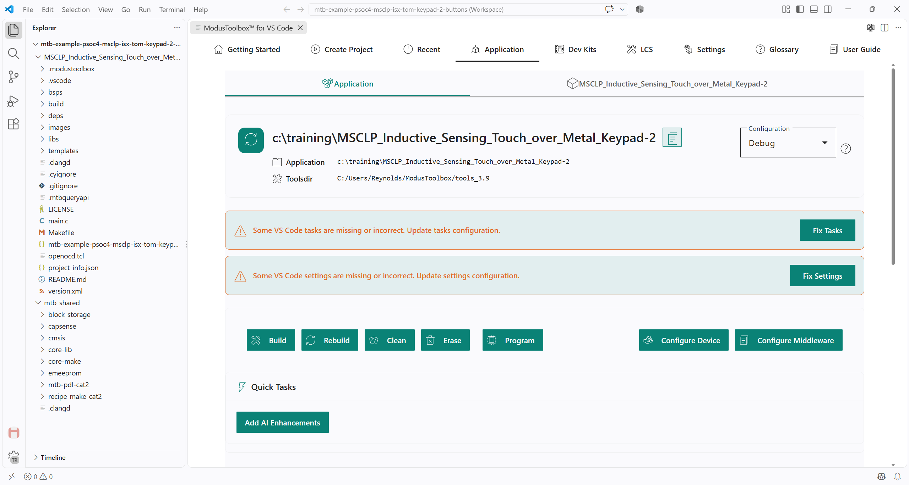

> **Note:** The ModusToolbox&trade; for VS Code extension may display buttons indicating that the VS Code tasks and settings need to be updated. Simply click the buttons to correct the issues. This is a minor version mismatch between the ModusToolbox&trade; tools and the VS Code extension and does not affect functionality.

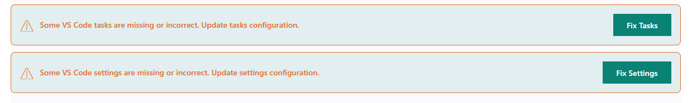

### Calibration procedure

#### Stage 1 – Set the initial hardware parameters

The initial hardware parameters include:

* CAPSENSE&trade; IMO clock frequency setting
* Modulator clock divider
* Number of initial sub-conversions
* CIC2 hardware filter
* Hardware and software IIR filter configuration
* Inactive sensor connection
* Shield configuration (mode and count)
* Raw count calibration-level
* Sense clock configuration (divider and clock source)
* Number of sub-conversions
* Decimation rate
* GPIO configuration
* Sensor pins, CMOD pins, and shield pins
* Scan slots
* Initial touch and noise thresholds, debounce, and hysteresis

1. Open the **Device Configurator** from the **ModusToolbox&trade; for VS Code** extension

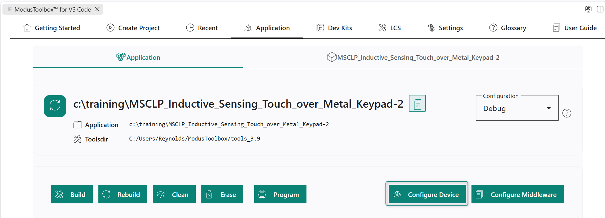

2. Enable the CAPSENSE&trade; channel in **Device Configurator** and save the changes

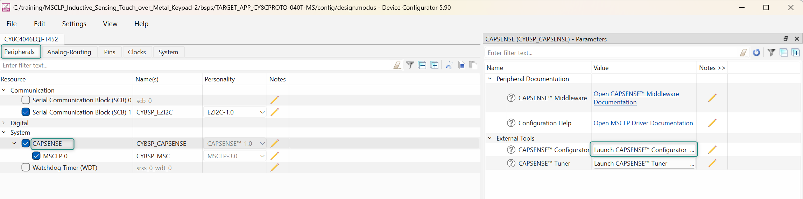

3. Launch the CAPSENSE&trade; Configurator tool. In the **Basic** tab, configure the Button widgets and low-power widgets as ISX-RM

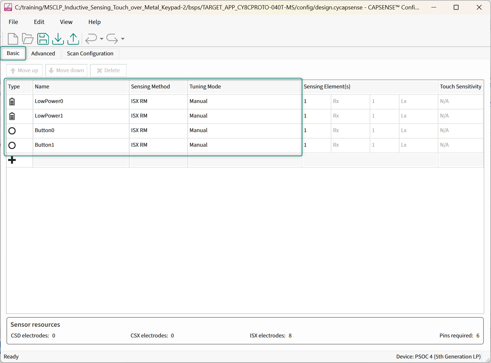

4. Click **Advanced → General tab** to configure the initial CAPSENSE&trade; IMO clock frequency and divider as well as the initial filter settings:
    * Select **CAPSENSE&trade; IMO Clock frequency** as **46 MHz**
    * Set the **Modulator clock divider** to **1** to obtain the maximum available modulator clock frequency
    * Set the **Number of init sub-conversions** based on the hint shown when you hover over the edit box. Retain the default value
    * Use **Wake-on-Touch settings** to set the refresh rate and frame timeout while in the lowest power mode (Wake-on-Touch mode). Set **the Wake-on-Touch scan interval (µs) based on the required low-power-state** scan refresh rate. For example, to get a 16-Hz refresh rate, set the value to **62500**
    * Set the **Number of frames in Wake-on-Touch** as the maximum number of frames to be scanned in WoT mode if there is no touch detected. This determines the maximum time the device will be kept in the lowest-power mode if there is no user activity. Calculate the maximum time by multiplying this parameter by the **Wake-on-Touch scan interval (µs)** value. For example, to get 10 s as the maximum time in WoT mode, set the **Number of frames in Wake-on-Touch** to **160** for the scan interval set as 62500 µs
    * Retain the default settings for all regular and low-power widget filters. The filters will be enabled or updated later, depending on the SNR requirements in [Stage 3: Fine-tune for required SNR, power, and refresh rate](#_Stage_3_–_1). The filters reduce the peak-to-peak noise, and using software filters results in a higher scan time

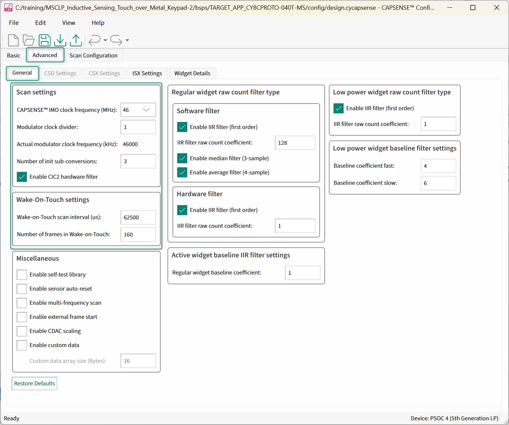

5. Go to the ISX settings tab and adjust the Raw count calibration level (%), which helps to achieve the required CDAC calibration levels (35% of maximum count by default) for all ISX sensors, while maintaining the same sensitivity across the sensor elements

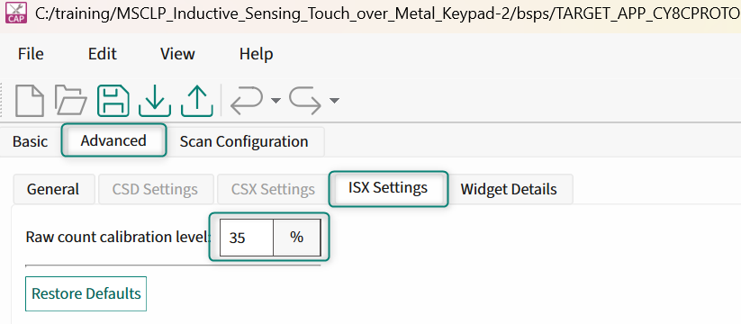

6. Click **Advanced → Widget Details** tab. Select LowPower0 from the left pane, and then set the following:

    * Sense clock divider: Retain the default value (this will be set in [Stage 2: Set the Lx Clock Divider](#_Stage_2_–))
    * Clock source: Direct
    * Number of sub-conversions: 60. ('60' is a good starting point to ensure a fast scan of time and a sufficient signal. This value is adjusted as required in [Stage 3: Fine-tune for required SNR](#_Stage_3_–_1), power, and refresh rate.)
    * Finger threshold: 65535. The finger threshold is set to maximum to avoid waking up the device from the WoT mode due to touch detection; this is required to find the signal and SNR
    * Noise threshold: 10
    * Negative noise threshold: 10
    * Low baseline reset: 10
    * ON debounce: 3

These threshold values reduce the influence of the baseline on the sensor signal, which helps to get the true difference count. These parameters are set in [Stage 4: Tune threshold parameters](#_Stage_4_–_1).

Next, select the other widgets from the left pane, and repeat the same configuration for each sensor.

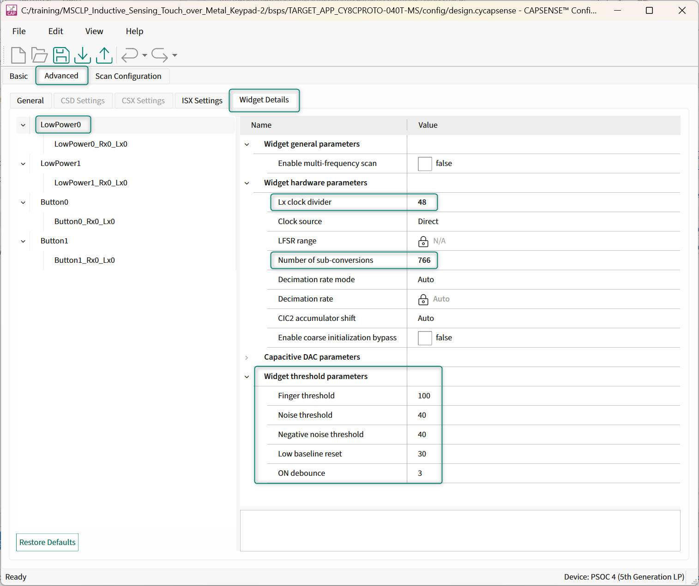

7. Go to the Scan Configuration tab to select the pins and the scan slots. Follow the steps below:

    * Configure pins for the electrodes using the drop-down menu. Each sensor requires a minimum of one TX pin and one RX pin for inductive sensing operation. The connection can be seen below 
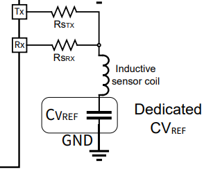

    * Configure the scan slots using the Auto-assign slots option. The other option is to allot each sensor a scan slot based on the entered slot number
    * Check the notice list for warnings or errors 
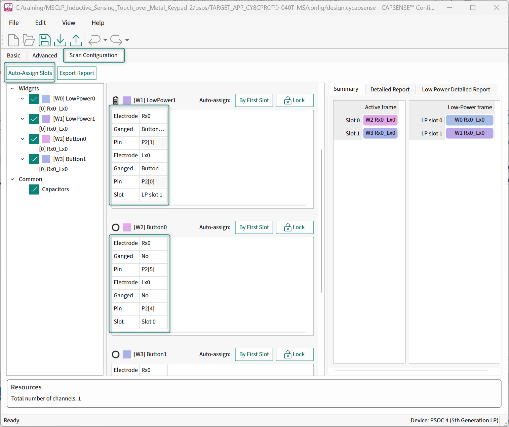

8. Click **Save** to apply the settings

#### Stage 2 – Set the Lx Clock Divider

The Lx clock is derived from the modulator clock using a clock-divider and is used to scan the sensor. The Lx clock divider should be configured such that the pulse width of the sense clock is long enough to allow the sensor inductance to accumulate its energy completely while preventing prolonged charging, which will waste scan time. This is verified by observing the current waveforms of the sensor series resistance Rstx, using an oscilloscope and active probes.

Follow the steps below to obtain the Lx clock divider value:

1. Find the expected/approximate value of the Lx clock divider using the following equation

$$
\begin{aligned}
\mathrm{Lx\ Clock\ Div} &= \frac{\mathrm{Ntau} \times \mathrm{Nphases} \times \mathrm{Fmod\ (MHz)} \times \mathrm{L\ (\mu H)}}{\mathrm{Rstx} + \mathrm{Rswitch} + \mathrm{Rinductor}} + \mathrm{Settling\ Shift} \\
\mathrm{Lx\ Clock\ Div} &= \frac{3 \times 4 \times 46 \times 34}{560 + 120} + 8 \\
\mathrm{Lx\ Clock\ Div} &= 4 \times \operatorname{round}\left(\frac{35.6}{4}\right) \\
\mathrm{Lx\ Clock\ Div} &< 8 = 36
\end{aligned}
$$

where,

* **Lx clock divider:** Approximate value is obtained
* **Ntau:** Settling constant. By default, set to 3
* **Nphases:** Number of scan phases. Set to 4
* **Fmod (MHz):** Modulator clock frequency in MHz. In this example, 46 MHz
* **L (µH):** Obtain the inductance value using an LCR meter. For the buttons in this example, the value is around 34 µH
* **Rstx/Rext:** The Tx resistor in series. 560 Ω in this kit
* **Rswitch/Rint:** Internal switch resistance. The default value can be set as 100 Ω
* **Rinductor:** This value can be obtained using the LCR meter while obtaining the inductance value. It must be included when the sensor is larger and can contribute to the total resistance value significantly
* **Settling Shift:** Provide a shift to consider the actual settling time. The default value is 8. This can be changed based on oscilloscope observations

This value serves only as a starting point for your measurements. Set the value in the CAPSENSE&trade; configurator.

2. Program the device from the **ModusToolbox&trade; for VS Code extension**

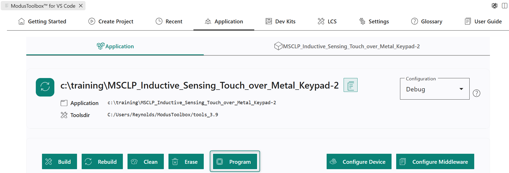

3. Open the **CAPSENSE&trade; Tuner** from the **ModusToolbox&trade; for VS Code extension**

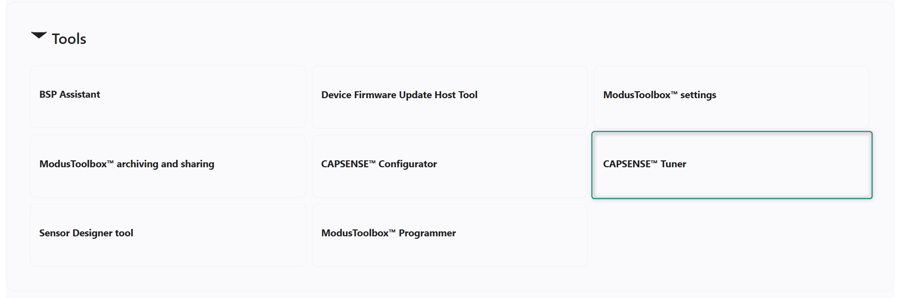

4. Setup the I2C communication in the **CAPSENSE&trade; Tuner**

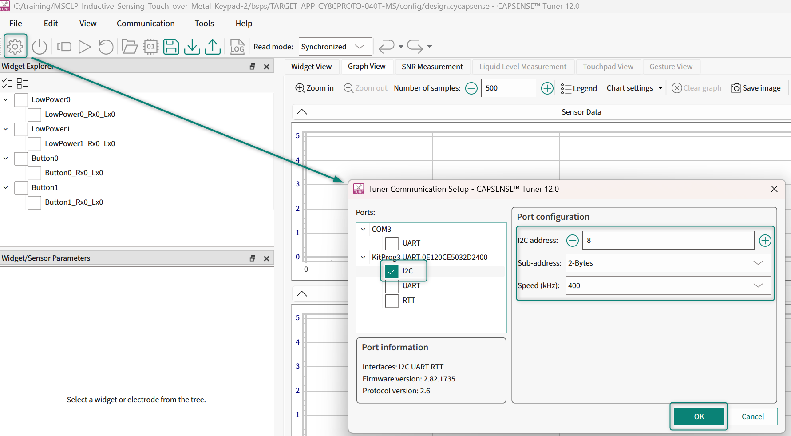

5. Connect to the device and begin streaming. Select all widgets in the **Widget Explorer**

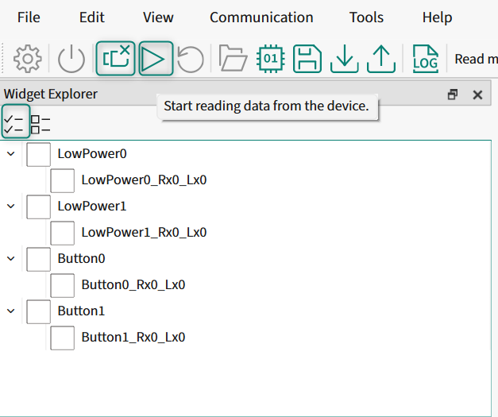

6. Probe the Rstx resistor on both sides as shown below, and then perform a math function on the oscilloscope to obtain the approximate current flowing through the resistor
Calculate M1 = (Ch4 - Ch3) / Rstx. On this kit, the value of Rstx is 560 Ω

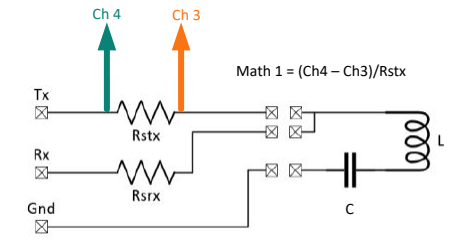

7. Adjust the **Lx clock divider** from the **Widget/Sensor Parameter** view

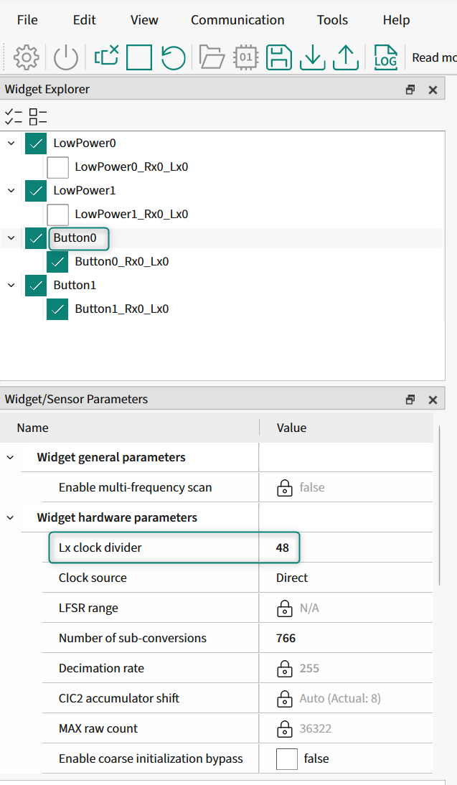

* Ensure that the charging and discharging of the inductive sensor are not incomplete. If so, increase the Lx clock divider

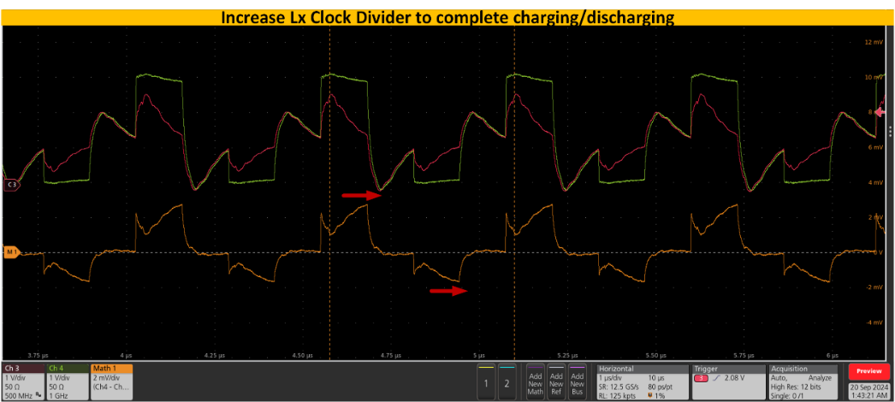

* Ensure that the inductive sensor is not charging and discharging for a prolonged time. If so, decrease the Lx clock divider

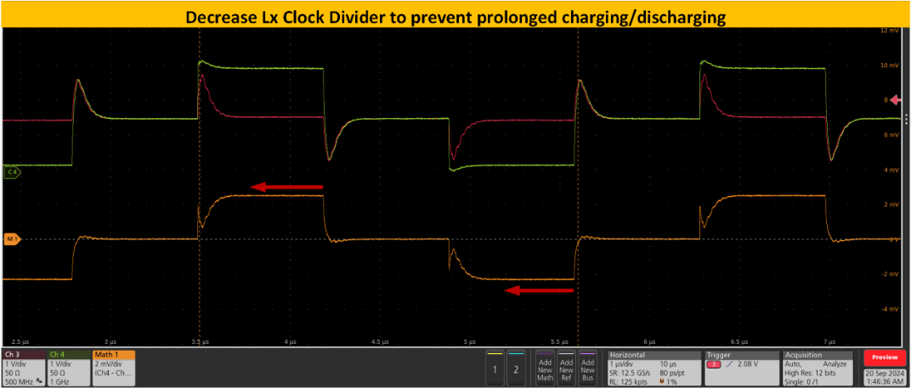

* Adjust the Lx clock divider value such that the charging and discharging are just completed as shown below

8. Repeat this process for all the sensors. Each sensor might require a different Lx clock divider value to charge/discharge completely

#### Stage 3 – Fine-tune for required SNR

The sensor should be tuned to have a minimum SNR of 10:1 and a minimum signal of 50 to ensure reliable operation. The sensitivity can be increased by increasing the number of sub-conversions, and noise can be decreased by enabling filters.

The steps for optimising these parameters are as follows:

1. Find the number of sub-conversions for each widget based on your Lx Clock Divider and scan time values (800 µs in this example)

    $$
    \mathrm{NumOfSubConv} = \operatorname{floor}\left(\frac{\mathrm{ScanTime}(\mathrm{us}) \times \mathrm{Fmod}(\mathrm{MHz})}{\mathrm{LxClkDiv}}\right)
    $$

    * Lx Clock Divider = 36
    * ScanTime (us) = 800 us
    * Fmod (MHz) = 46 MHz (default)

2. Switch to the **SNR Measurement** tab for measuring the SNR, select Button0 and Button0\_Rx0\_Lx0 sensor, and then click **Acquire noise** as shown below

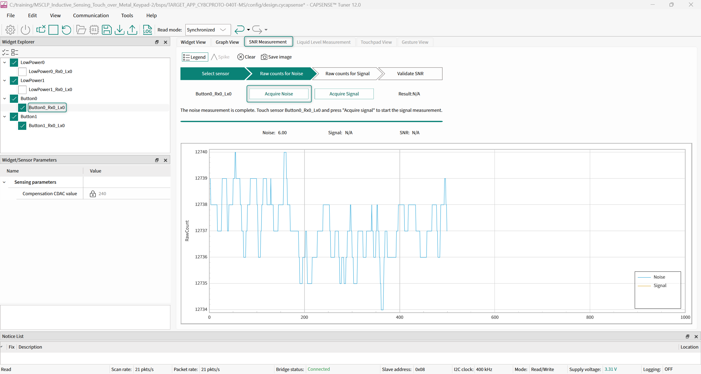

3. Once the noise is acquired, place the finger at a position on the button and then click **Acquire signal**. Ensure that the finger remains on the button if the signal acquisition is in progress. Observe that the SNR is greater than 10:1 and the signal count is above 50

4. The calculated SNR on this button is displayed, as shown below. Based on the end system design, test the signal with a finger press force that matches the normal use case. Also, test using lighter presses that will be rejected by the system to ensure that they do not reach the finger threshold

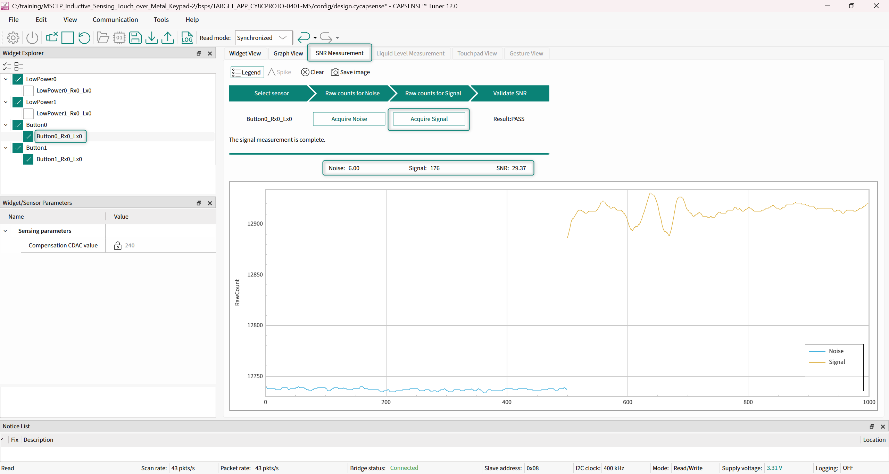

5. If the SNR is less than 10:1, increase the number of sub-conversions. Edit the number of sub-conversions (Nsub) directly in the Widget/Sensor parameters tab of the CAPSENSE&trade; tuner

6. Apply the parameters to the device and measure SNR again to get the required SNR

    * If the system is noisy (> 40% of signal), enable the filters based on the type of noise
    * Enable a hardware IIR filter to eliminate high-frequency noise. Set the filter coefficient value to ‘1’. Higher values of the coefficient provide better noise suppression but also slow down the touch response and need to be adjusted based on the requirements
    * Enable the average filter (moving average) to eliminate periodic noise (i.e., noise from AC mains), if present
    * Enable median filter to eliminate spike noise (i.e., motors and switching power supplies), if present
    * Enable the CIC2 filter to increase resolution (recommended to enable this by default). Set the decimation rate to the maximal allowable value and leave the CIC2 accumulator shift value to Auto (widget hardware parameters)

This example has the CIC2 filter enabled, which increases the resolution for the same scan time. Whenever the CIC2 filter is enabled, it is recommended to enable the IIR filter for optimal noise reduction.

7. Open CAPSENSE&trade; Configurator from the ModusToolbox&trade; for VS Code extension and select the appropriate filter. Enable the filter based on the type of noise in your system and click Save, and program the device to update the filter settings

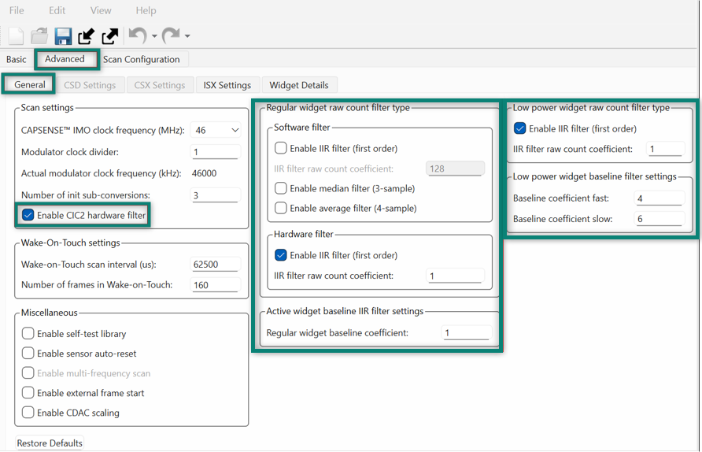

#### Stage 4 – Tune threshold parameters

Various thresholds, relative to the signal, need to be set for each sensor. Follow the steps below in the CAPSENSE&trade; tuner to set up the thresholds for a widget:

1. Switch to the **Graph View** tab and select Button0

2. Touch the sensor and monitor the touch signal in the Sensor signal graph, as shown below

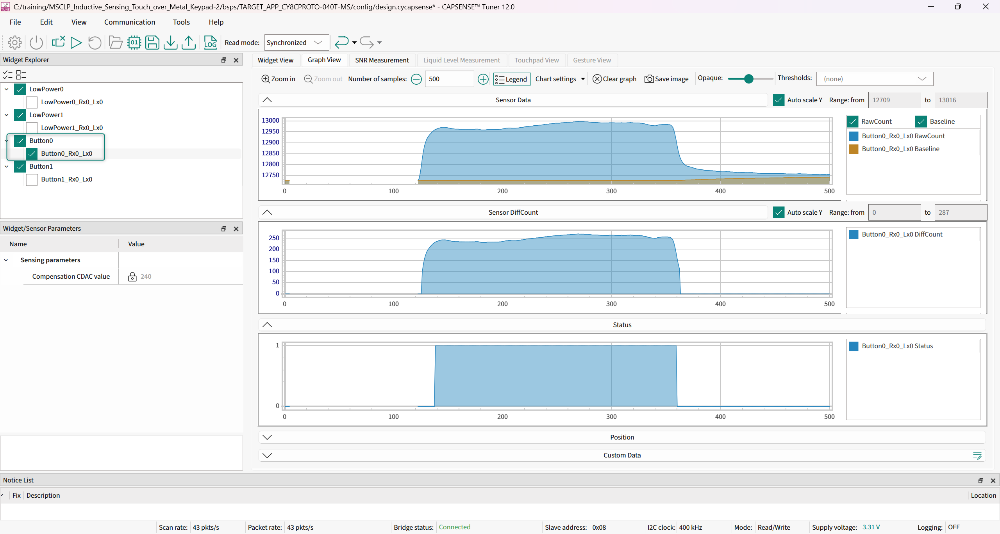

3. Note the signal measured and set the thresholds according to the following recommendations:
    * Finger threshold: 80% of the signal
    * Noise threshold: 40% of the signal
    * Negative noise threshold: 40% of the signal
    * Hysteresis: 10% of the signal
    * Debounce: 3

4. Set the threshold parameters in the Widget/Sensor parameters section of the CAPSENSE&trade; Tuner

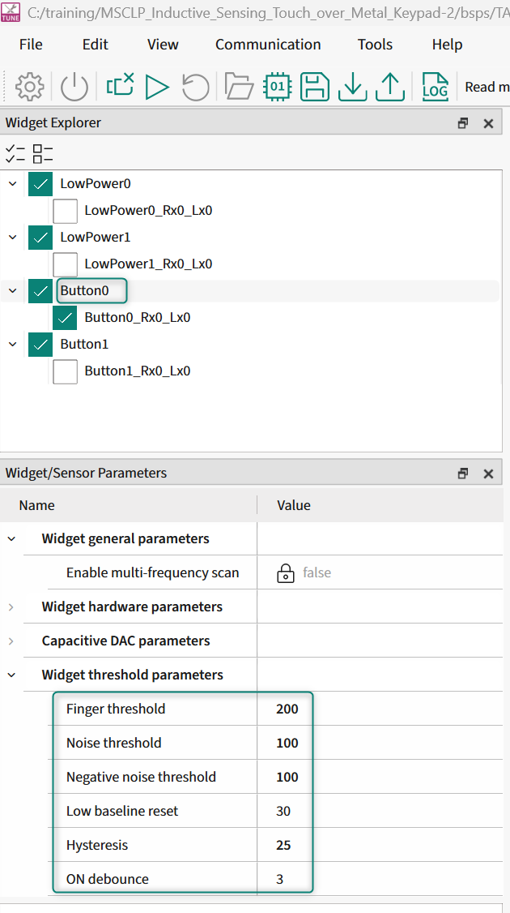

| Parameter | Button0 | LowPower0 |
| --- | ---: | ---: |
| Signal | 250 | 160 |
| Finger threshold | 200 | 100 |
| Noise threshold | 100 | 40 |
| Negative noise threshold | 100 | 40 |
| Low baseline reset | 30 | 30 |
| Hysteresis | 25 | NA |
| ON debounce | 3 | 3 |

5. For all the buttons, first configure the finger threshold to ‘65535’, which is the max value. Repeat steps 2 to 4 for all the buttons

6. Apply the settings to the device by clicking **Apply to Device**, as shown below

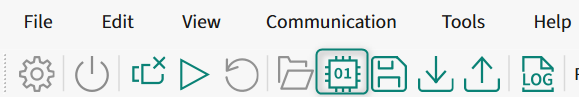

7. Click **Apply to Project**, as shown below. The change is updated in the **design.cycapsense** file. Close CAPSENSE&trade; Tuner and launch CAPSENSE&trade; Configurator. All the changes in the CAPSENSE&trade; Tuner are reflected in the CAPSENSE&trade; Configurator

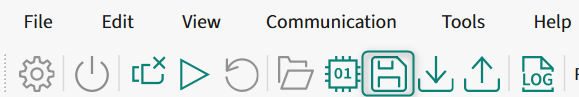

### Output

After applying the configuration test, the performance is tested by touching the button. If your sensor is tuned correctly, you will notice that the touch status changes from ‘0’ to ‘1’ in the Status panel of the **Graph View** tab.

The status of the button is also indicated by LED1 in the kit; LED1 turns ON when the finger touches the button and turns OFF when the finger is removed.

### Conclusion

In this exercise, you tuned inductive sensing-based Touch-over-Metal keypad buttons. This low-power application demonstrates the recommended power states and transitions and the tuning flow for inductive-sensing buttons. You learned how to calibrate and tune inductive-sensing buttons for industrial applications using manual tuning and gained insight into using the ModusToolbox&trade; application in real time. You can follow this procedure to tune any touch-based HMI application for responsive performance using inductive sensing.

## Inductive sensor with smart sensing tuning procedure

### Objective

The objective of this exercise is to learn how to use the Inductive sensing (ISX) with the smart sensing tuning process. The MSCLP Inductive Sensing Touch over Metal Keypad-4 example project will have the device configured for optimal inductive sensor tuning, but tweaks can be made to show how each setting impacts the sensitivity of the sensors.
The smart sensing algorithm is a tuning method that automatically sets sensing parameters for optimal performance, based on user-specified inductance values, and continuously compensates for system, manufacturing, and environmental changes. Smart sensing reduces design cycle time and ensures performance is independent of PCB variations compared to a manual tuning procedure.

### Description

To tune the inductive sensor, follow the performance tuning procedure described below. The process is divided into three stages.

* [Set the initial hardware parameters](#_Stage_1_–_1)
* [Fine-tune for the required SNR](#_Stage_2_–_2)
* [Tune threshold parameters](#_Stage_3_–)

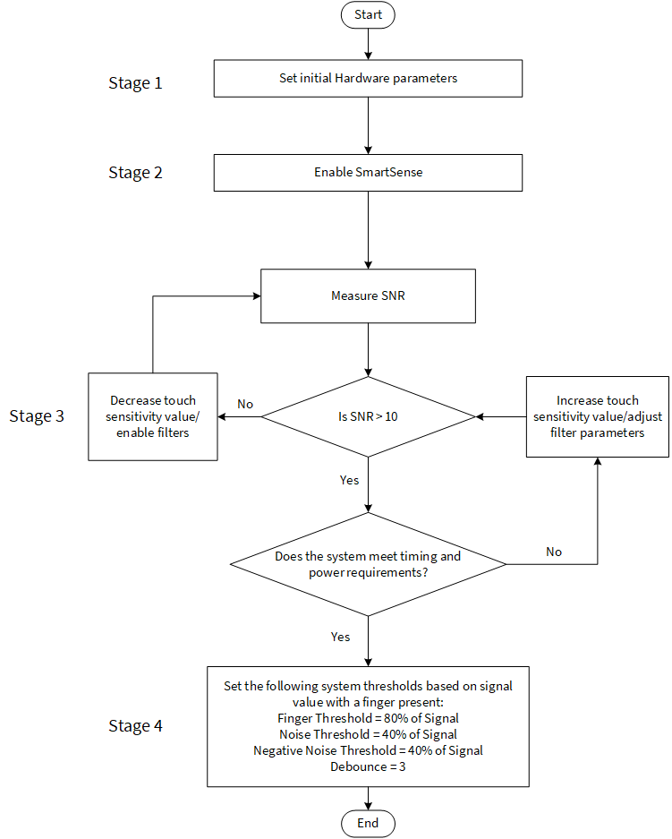

### Project creation

1. Before creating the first project in this training series, create the workspace. Open **VS Code** from the **Windows Start** menu

> **Note:** If you have not installed ModusToolbox&trade; along with the ModusToolbox&trade; for VS Code extension, see the [Required development tools](#_Required_development_tools) section.

2. Open a **workspace directory** for your project in VS Code

3. Click **File > Open Folder** and choose your workspace directory or create a new folder
4. Click **Select Folder** to open the workspace directory in VS Code

> **Note:** Open the workspace in trusted mode. If the default workspace trust is restricted mode, click **Restricted Mode** in the bottom left and change to trust this folder.

5. Open the **Command Palette** by pressing **Ctrl+Shift+P**
6. Search for **Infineon ModusToolbox&trade;: Show Main Page** and select it
7. Open the **Infineon ModusToolbox&trade; for VS Code** main page

8. Navigate to the **Create Project** tab and click **Launch Project Creation**
9. The **Project Creator Tool** opens and prompts you to choose a **BSP** (Board Support Package). Select the **CY8CPROTO-040T-MS BSP** under the **PSOC&trade; 4 BSPs**, and continue to the application selection

> **Note:** BSPs are aligned with the development and evaluation kits; they provide files for basic device functionality. A BSP typically has a **design.modus** file that configures clocks and other board-specific capabilities. That file is used by the ModusToolbox&trade; configurators. A BSP also includes the required device support code for the device on the board. You can modify the configuration to suit your application.

10. Select the **MSCLP Inductive Sensing Touch over Metal Keypad-4** under the **Sensing** section, choose a project directory, and create the project

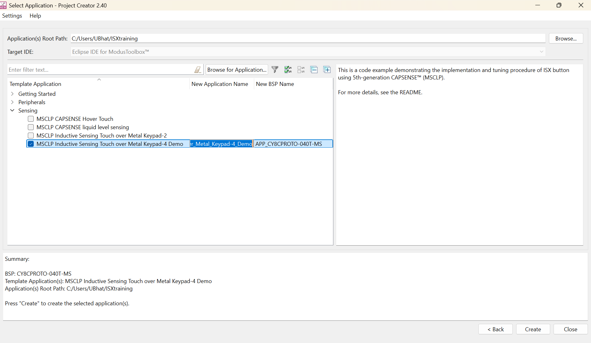

11. When project creation is complete, it will prompt you to **Load Project**. Do this so that the VS Code workspace for the new project is loaded

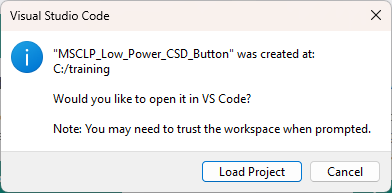

12. Once the workspace is loaded, the ModusToolbox&trade; application view provides actions to build, clean, erase, program, and configure the device

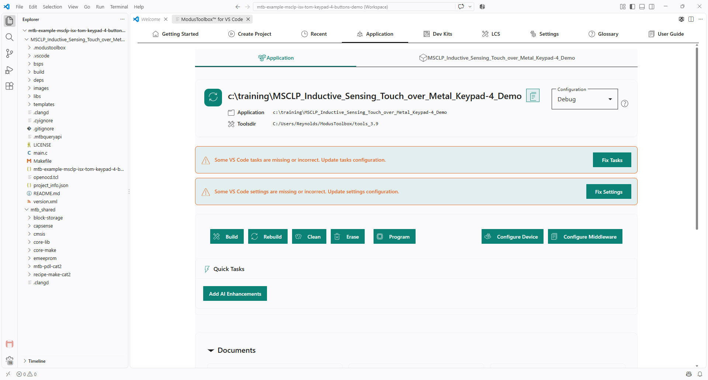

> **Note:** The ModusToolbox&trade; for VS Code extension may display buttons indicating that the VS Code tasks and settings need to be updated. Simply click the buttons to correct the issues. This is a minor version mismatch between the ModusToolbox&trade; tools and the VS Code extension and does not affect functionality.

### Calibration procedure

#### Stage 1 – Set the initial hardware parameters

The initial hardware parameters include the following:

* CAPSENSE&trade; IMO clock frequency setting
* Modulator clock divider
* Number of initial sub-conversions
* CIC2 hardware filter
* Hardware and software IIR filter configuration
* Inactive sensor connection
* Shield configuration (mode and count)
* Raw count calibration level
* Sense clock configuration (divider and clock source)
* Number of sub-conversions
* Decimation rate
* GPIO configuration
* Sensor pins, CMOD pins, and shield pins
* Scan slots
* Initial touch and noise thresholds, debounce, and hysteresis

1. Open the **CAPSENSE&trade; Configurator** from the **ModusToolbox&trade; for VS Code** extension

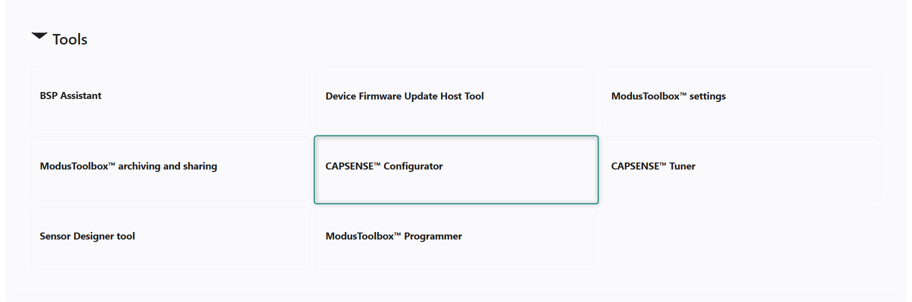

2. In the **Basic** tab, configure the Button widgets and low-power widgets as ISX-RM as shown below. Set the Tuning Mode as SMARTSENSE - HW parameters for the low power widgets and SMARTSENSE - Full for the regular widgets. In the **SMARTSENSE - HW parameters mode**, set the thresholds manually. In the **SMARTSENSE - Full mode**, set the thresholds using the middleware. However, this mode is not available for low-power widgets
Keep the touch sensitivity at its default value of 0.16 µH. The touch sensitivity is the minimum delta in inductance that the system is tuned for by the smart sense

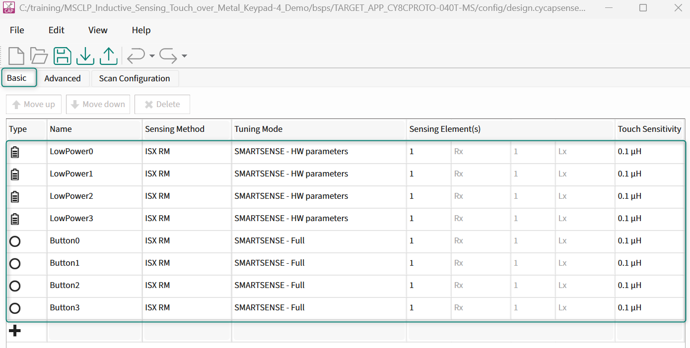

3. Open the **Advanced → General tab** to configure the initial CAPSENSE&trade; IMO clock frequency and divider as well as the initial filter settings

    * Select **CAPSENSE&trade; IMO Clock frequency** as **46 MHz**
    * Set the **Modulator clock divider** to **1** to obtain the maximum available modulator clock frequency
    * Set the **Number of init sub-conversions** based on the hint shown when you hover over the edit box. Retain the default value
    * Use **Wake-on-Touch settings** to set the refresh rate and frame timeout while in the lowest power mode (Wake-on-Touch mode). Set **the Wake-on-Touch scan interval (µs) based on the required low-power-state** scan refresh rate. For example, to achieve a 16-Hz refresh rate, set the value to **62500**
    * Set the **Number of frames in Wake-on-Touch** as the maximum number of frames to be scanned in WoT mode if there is no touch detected. This determines the maximum time the device will be kept in the lowest-power mode if there is no user activity. Calculate the maximum time by multiplying this parameter by the **Wake-on-Touch scan interval (µs)** value
    * For example, to get 10 s as the maximum time in WoT mode, set the **Number of frames in Wake-on-Touch** to **160** for the scan interval set as 62500 µs
    * Retain the default settings for all regular and low-power widget filters. The filters will be enabled or updated later, depending on the SNR requirements in [Stage 2: Fine-tune for required SNR](#_Stage_2_–_2). The filters reduce the peak-to-peak noise, and using software filters results in a higher scan time

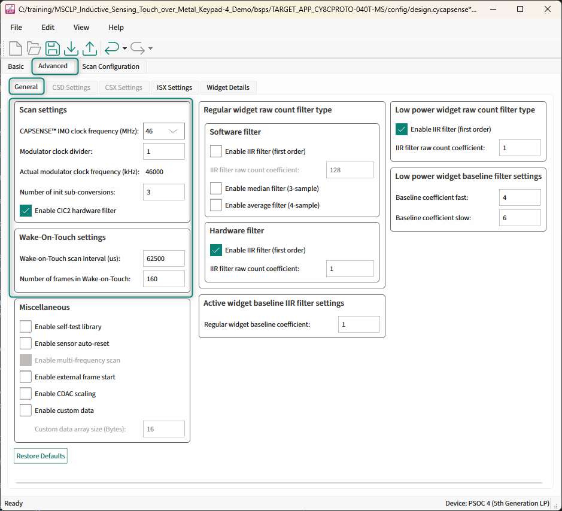

4. Go to the ISX settings tab and adjust the Raw count calibration level (%), which helps to achieve the required CDAC calibration levels (35% of maximum count by default) for all ISX sensors, while maintaining the same sensitivity across the sensor elements

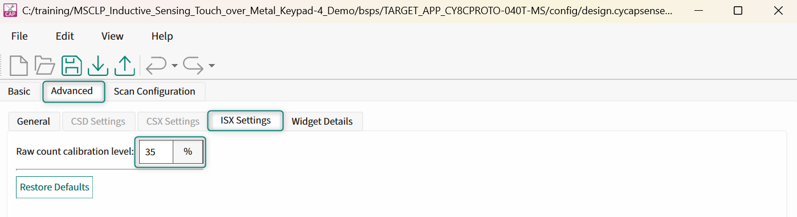

> **Note:** When tuning a low-power sensor, go to the **Advanced → Widget** Details tab. Select a low-power sensor from the left pane, and then set the following:
> 
> * **Finger threshold**: 65535. This is set to maximum to avoid waking up the device from the WoT mode due to touch detection; this is required to find the signal and SNR
> * **Noise threshold**: 10
> * **Negative noise threshold**: 10
> * **Low baseline reset**: 10
> * **ON debounce**: 3
> 
> These threshold values reduce the influence of the baseline on the sensor signal, which helps to get the true difference count. These parameters are set in [Stage 3: Tune threshold parameters](#_Stage_3_–).
> 
> 

> 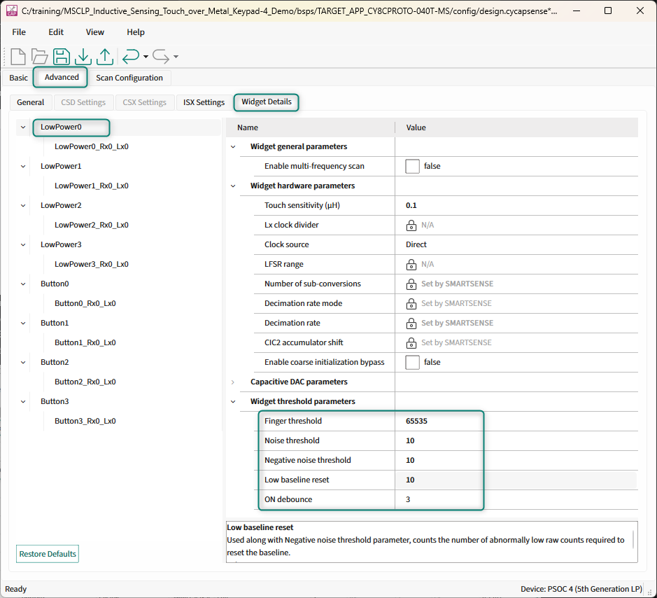
> 

5. Go to the **Scan Configuration** tab to select the pins and the scan slots and do the following:

    * Configure pins for the electrodes using the drop-down menu
    * Configure the scan slots using the Auto-assign slots option. The other option is to allot each sensor a scan slot based on the entered slot number
    * Check the notice list for warnings or errors

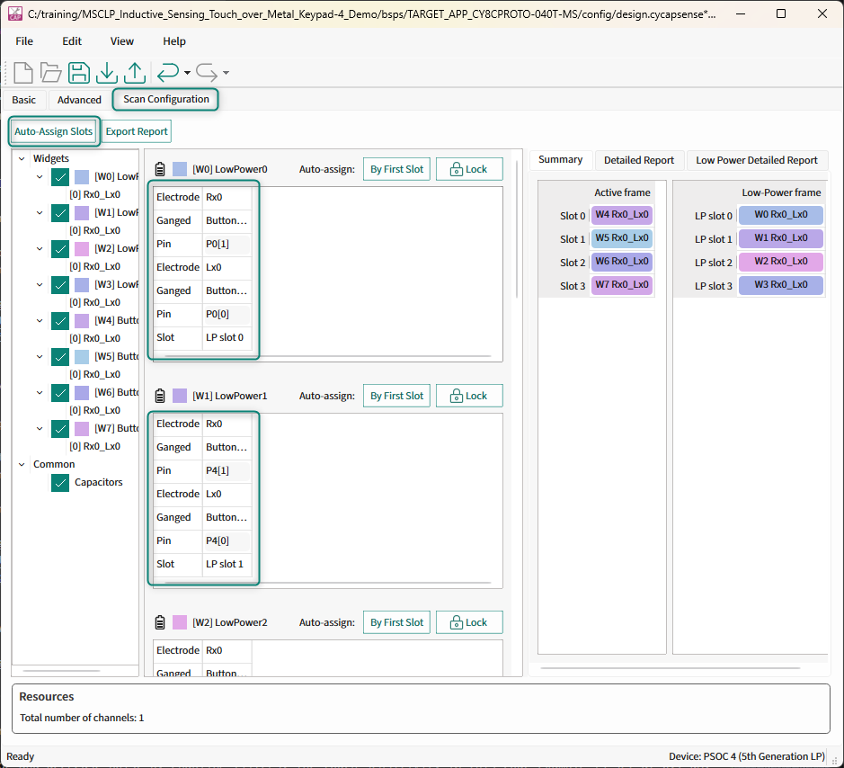

6. Click **Save** to apply the settings

#### Stage 2 – Fine-tune for required SNR

Tune the sensor to have a minimum SNR of 10:1 and a minimum signal of 50 to ensure reliable operation. Increase the sensitivity by decreasing the touch sensitivity value (the minimum delta inductance that the system should detect) in the configurator and decrease noise by enabling filters. The touch sensitivity in this code example is set at 0.1 µH.

1. Measure the SNR as mentioned in the [Stage 3 - Fine-tune for required SNR](#_Stage_3_–_1) section for all widgets

2. If the SNR is less than 10:1, decrease the touch sensitivity value. You can find this value in the **Advanced→Widget Details** tab

3. Load the parameters to the device and measure the SNR again

4. Repeat steps **1** to **3** until the following conditions are met:
    * Measured SNR from the previous stage is greater than 10:1
    * Signal count is greater than 50

5. If the system is noisy (> 40% of signal), enable the filters based on the type of noise
    * This example has the CIC2 filter enabled, which increases the resolution for the same scan time. Whenever a CIC2 filter is enabled, it is recommended to enable the IIR filter for optimal noise reduction

6. Open CAPSENSE&trade; Configurator from the ModusToolbox&trade; for VS Code extension and select the appropriate filter as shown below

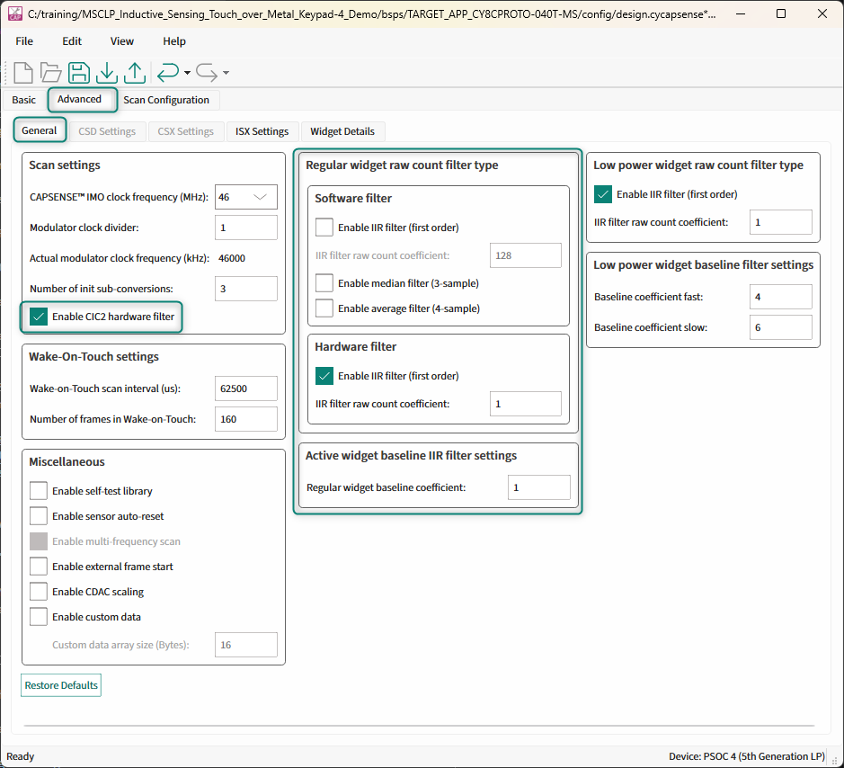

7. Click **Save** and program the device to update the filter settings

#### Stage 3 – Tune threshold parameters

In the SMARTSENSE - HW parameter tuning mode, the various thresholds, relative to the signal, need to be set for each low-power widget. For the regular widgets, the threshold parameters are automatically set by the SMARTSENSE - Full tuning mode.

Perform the following in CAPSENSE&trade; Tuner to set up the thresholds for a low-power widget:

1. Switch to the **Graph View** tab and select Button0

2. Press the sensor and monitor the touch signal in the Sensor signal graph, as shown below

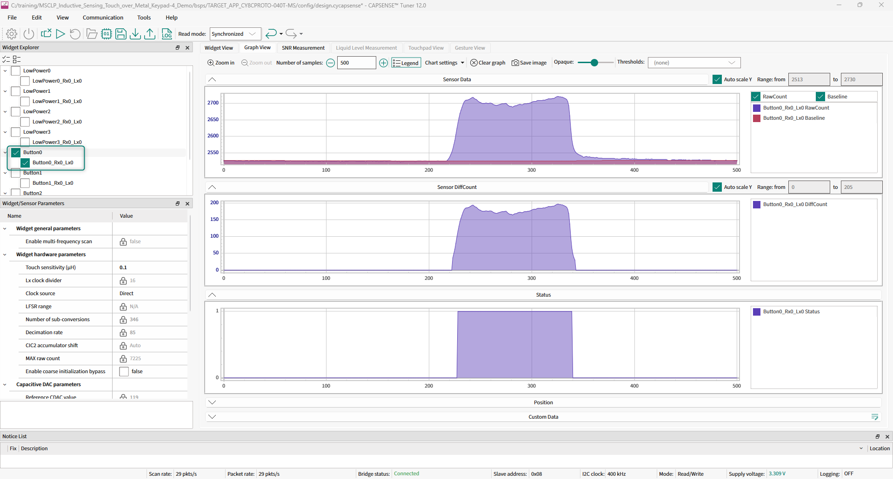

3. Note that when tuning low-power sensors with the smart sense enabled, the touch thresholds must be manually tuned. Measure the signal and set the thresholds according to the following recommendations:
    
    * **Finger threshold**: 80% of the signal
    * **Noise threshold**: 40% of the signal
    * **Negative noise threshold**: 40% of the signal
    * **Debounce**: 3

4. Adjust the touch sensitivity in the Widget/Sensor parameters section of the CAPSENSE&trade; Tuner:

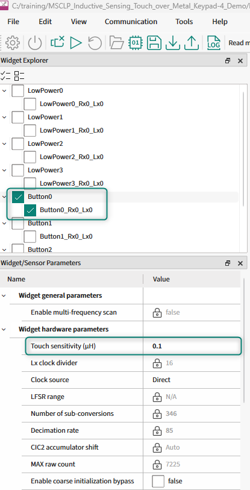

5. Apply the settings to the device by clicking **Apply to Device**, as shown below

6. Apply the settings to the project by clicking **Apply to Project**, as shown below

7. The change is updated in the design.cycapsense file. Close CAPSENSE&trade; Tuner and launch CAPSENSE&trade; Configurator. All the changes in the CAPSENSE&trade; Tuner are reflected in the CAPSENSE&trade; Configurator

### Output

After applying the configuration, test the performance by touching the button. If your sensor is tuned correctly, you will observe the touch status go from 0 to 1 in the Status panel of the Graph View tab. The status of the button is also indicated by LED2 in the kit; LED2 turns ON when the finger touches the button and turns OFF when the finger is removed.

### Conclusion

In this exercise, you tuned an inductive sensing-based Touch-over-Metal keypad button. This low-power application demonstrates the recommended power states and transitions and the smart sensing tuning flow for inductive-sensing buttons. You learned how smart sensing simplifies inductive sensing tuning for industrial applications and gained insight into using the ModusToolbox&trade; application in real time. You can follow this procedure to tune any touch-based HMI application for responsive performance using inductive sensing.

## References

1. Infineon Technologies AG: AN239751: Flyback inductive sensing (ISX) design guide; [Available online](https://www.infineon.com/row/public/documents/30/42/infineon-an239751-flyback-inductive-sensing-isx-design-guide-applicationnotes-en.pdf)

## Revision history

| Document revision | Date | Description of changes |
| :--- | :--- | :--- |
| \*\* | 2025-12-11 | Initial release |
| \*A | 2026-04-07 | Updated to align with Empower template. |

## Disclaimer

All referenced product or service names and trademarks are the property of their respective owners.

The Bluetooth&reg; word mark and logos are registered trademarks owned by Bluetooth SIG, Inc., and any use of such marks by Infineon is under license.

PSOC&trade;, formerly known as PSoC&trade;, is a trademark of Infineon Technologies. Any references to PSoC&trade; in this document or others shall be deemed to refer to PSOC&trade;.

---------------------------------------------------------

© Cypress Semiconductor Corporation, 2023-2026. This document is the property of Cypress Semiconductor Corporation, an Infineon Technologies company, and its affiliates ("Cypress").  This document, including any software or firmware included or referenced in this document ("Software"), is owned by Cypress under the intellectual property laws and treaties of the United States and other countries worldwide.  Cypress reserves all rights under such laws and treaties and does not, except as specifically stated in this paragraph, grant any license under its patents, copyrights, trademarks, or other intellectual property rights.  If the Software is not accompanied by a license agreement and you do not otherwise have a written agreement with Cypress governing the use of the Software, then Cypress hereby grants you a personal, non-exclusive, nontransferable license (without the right to sublicense) (1) under its copyright rights in the Software (a) for Software provided in source code form, to modify and reproduce the Software solely for use with Cypress hardware products, only internally within your organization, and (b) to distribute the Software in binary code form externally to end users (either directly or indirectly through resellers and distributors), solely for use on Cypress hardware product units, and (2) under those claims of Cypress's patents that are infringed by the Software (as provided by Cypress, unmodified) to make, use, distribute, and import the Software solely for use with Cypress hardware products.  Any other use, reproduction, modification, translation, or compilation of the Software is prohibited.
 
TO THE EXTENT PERMITTED BY APPLICABLE LAW, CYPRESS MAKES NO WARRANTY OF ANY KIND, EXPRESS OR IMPLIED, WITH REGARD TO THIS DOCUMENT OR ANY SOFTWARE OR ACCOMPANYING HARDWARE, INCLUDING, BUT NOT LIMITED TO, THE IMPLIED WARRANTIES OF MERCHANTABILITY AND FITNESS FOR A PARTICULAR PURPOSE.  No computing device can be absolutely secure.  Therefore, despite security measures implemented in Cypress hardware or software products, Cypress shall have no liability arising out of any security breach, such as unauthorized access to or use of a Cypress product. CYPRESS DOES NOT REPRESENT, WARRANT, OR GUARANTEE THAT CYPRESS PRODUCTS, OR SYSTEMS CREATED USING CYPRESS PRODUCTS, WILL BE FREE FROM CORRUPTION, ATTACK, VIRUSES, INTERFERENCE, HACKING, DATA LOSS OR THEFT, OR OTHER SECURITY INTRUSION (collectively, "Security Breach").  Cypress disclaims any liability relating to any Security Breach, and you shall and hereby do release Cypress from any claim, damage, or other liability arising from any Security Breach.  In addition, the products described in these materials may contain design defects or errors known as errata which may cause the product to deviate from published specifications. To the extent permitted by applicable law, Cypress reserves the right to make changes to this document without further notice. Cypress does not assume any liability arising out of the application or use of any product or circuit described in this document. Any information provided in this document, including any sample design information or programming code, is provided only for reference purposes.  It is the responsibility of the user of this document to properly design, program, and test the functionality and safety of any application made of this information and any resulting product.  "High-Risk Device" means any device or system whose failure could cause personal injury, death, or property damage.  Examples of High-Risk Devices are weapons, nuclear installations, surgical implants, and other medical devices.  "Critical Component" means any component of a High-Risk Device whose failure to perform can be reasonably expected to cause, directly or indirectly, the failure of the High-Risk Device, or to affect its safety or effectiveness.  Cypress is not liable, in whole or in part, and you shall and hereby do release Cypress from any claim, damage, or other liability arising from any use of a Cypress product as a Critical Component in a High-Risk Device. You shall indemnify and hold Cypress, including its affiliates, and its directors, officers, employees, agents, distributors, and assigns harmless from and against all claims, costs, damages, and expenses, arising out of any claim, including claims for product liability, personal injury or death, or property damage arising from any use of a Cypress product as a Critical Component in a High-Risk Device. Cypress products are not intended or authorized for use as a Critical Component in any High-Risk Device except to the limited extent that (i) Cypress's published data sheet for the product explicitly states Cypress has qualified the product for use in a specific High-Risk Device, or (ii) Cypress has given you advance written authorization to use the product as a Critical Component in the specific High-Risk Device and you have signed a separate indemnification agreement.
 
Cypress, the Cypress logo, and combinations thereof, ModusToolbox, PSoC, CAPSENSE, EZ-USB, F-RAM, and TRAVEO are trademarks or registered trademarks of Cypress or a subsidiary of Cypress in the United States or in other countries. For a more complete list of Cypress trademarks, visit www.infineon.com. Other names and brands may be claimed as property of their respective owners.